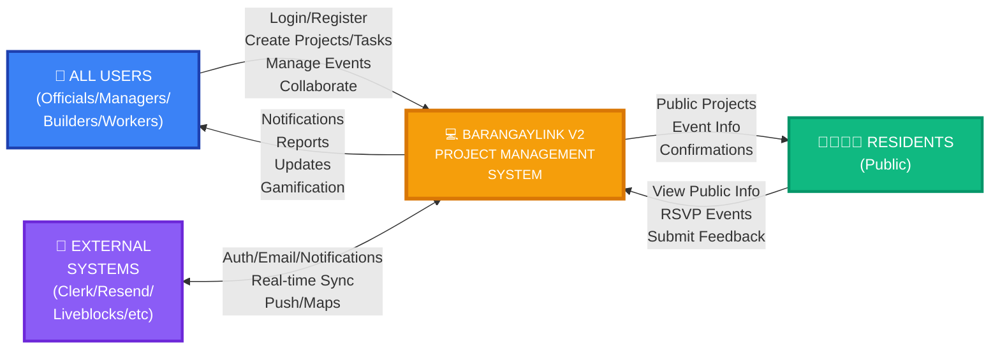
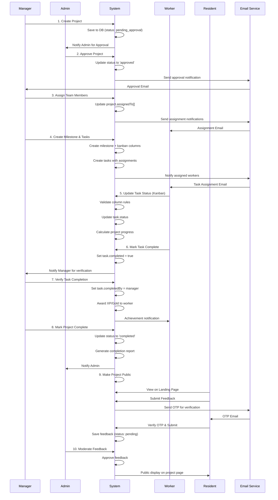
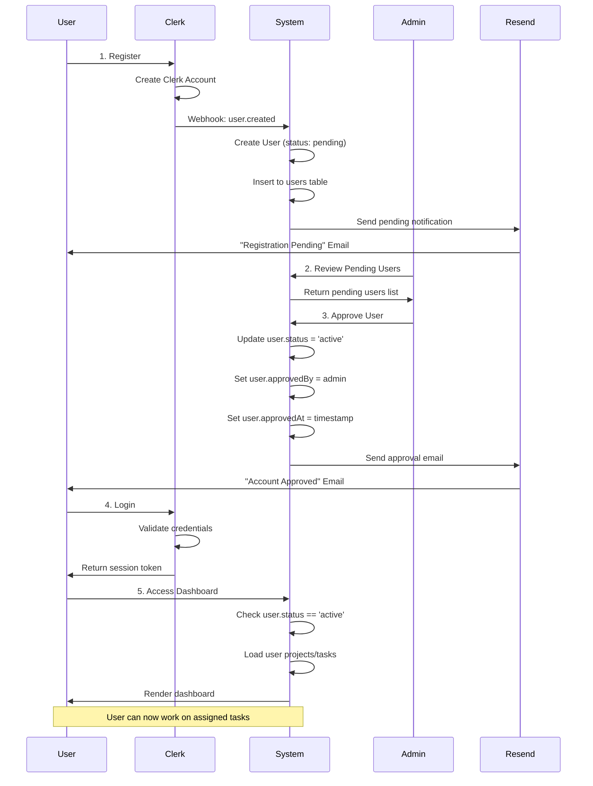
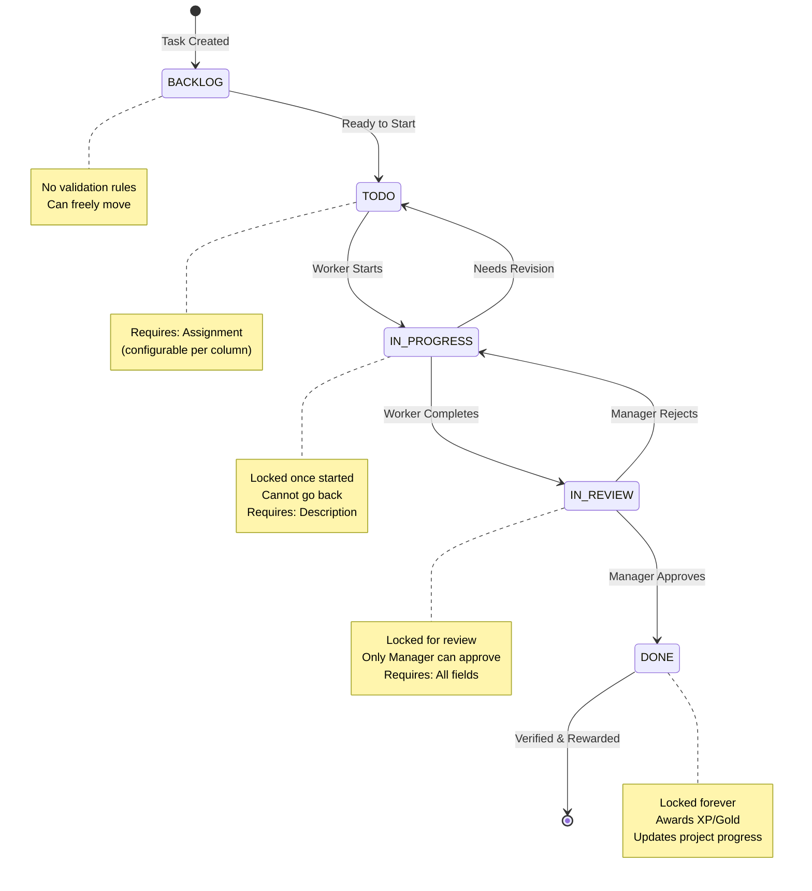
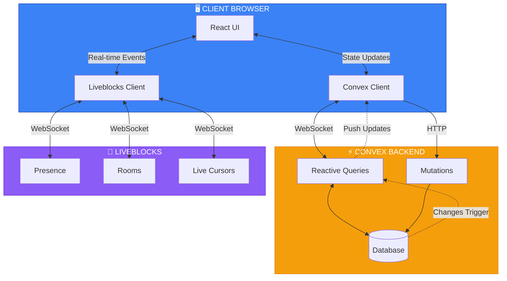
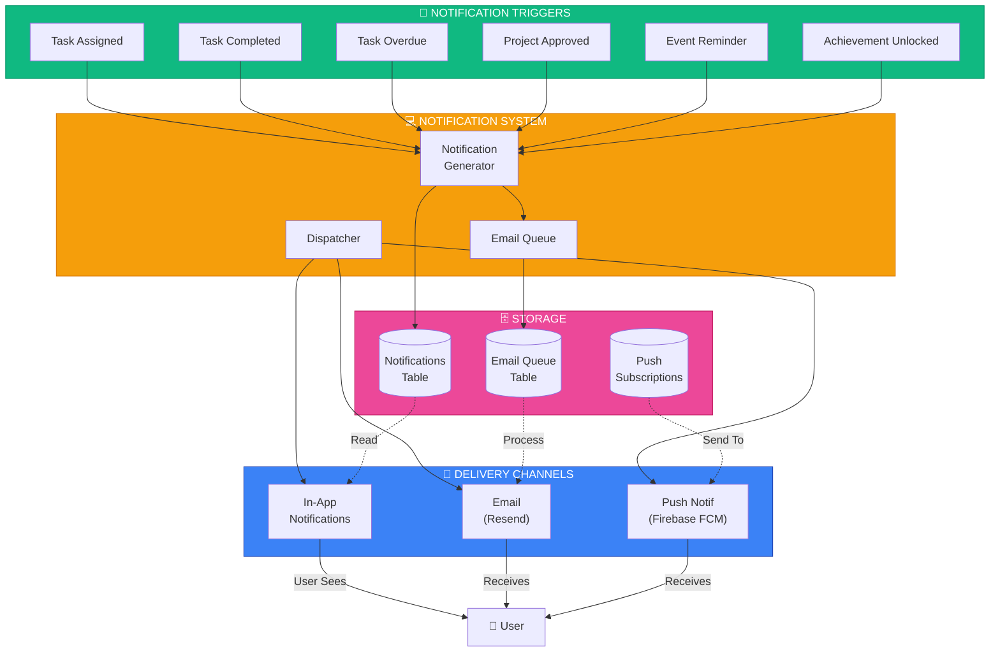

# BARANGAYLINK V2 - DATA FLOW DIAGRAM LEVEL 0 (VISUAL)

## Mermaid Diagram - Copy to Mermaid Live Editor for Visualization

You can visualize this diagram at: https://mermaid.live/

```mermaid
graph TB
    %% External Entities - Users
    subgraph USERS["👥 INTERNAL USERS"]
        ADMIN["🔑 BARANGAY OFFICIALS<br/>(Admin/Captain)"]
        MANAGER["👔 DEPARTMENT MANAGERS"]
        BUILDER["🔨 BUILDERS"]
        WORKER["👷 WORKERS"]
    end
    
    subgraph PUBLIC["🌐 EXTERNAL USERS"]
        RESIDENT["👨‍👩‍👧‍👦 RESIDENTS<br/>(Public)"]
    end
    
    %% External Systems
    subgraph EXTERNAL["🔌 EXTERNAL SYSTEMS"]
        CLERK["🔐 CLERK<br/>(Auth)"]
        RESEND["📧 RESEND<br/>(Email)"]
        LIVEBLOCKS["⚡ LIVEBLOCKS<br/>(Real-time)"]
        FIREBASE["🔔 FIREBASE<br/>(Push Notif)"]
        MAPBOX["🗺️ MAPBOX<br/>(Maps)"]
        MESSENGER["💬 FACEBOOK<br/>MESSENGER"]
    end
    
    %% Core System
    subgraph SYSTEM["💻 BARANGAYLINK V2 SYSTEM"]
        %% Main Processes
        P1["1.0<br/>USER MGMT &<br/>AUTHENTICATION"]
        P2["2.0<br/>PROJECT<br/>MANAGEMENT"]
        P3["3.0<br/>TASK MGMT<br/>(GAMIFIED)"]
        P4["4.0<br/>EVENT<br/>MANAGEMENT"]
        P5["5.0<br/>MILESTONE &<br/>SPRINT MGMT"]
        P6["6.0<br/>DOCUMENT<br/>MANAGEMENT"]
        P7["7.0<br/>MESSAGING &<br/>COLLABORATION"]
        P8["8.0<br/>NOTIFICATION<br/>SYSTEM"]
        P9["9.0<br/>FINANCIAL<br/>TRACKING"]
        P10["10.0<br/>PUBLIC<br/>ENGAGEMENT"]
        P11["11.0<br/>ANALYTICS &<br/>REPORTING"]
        P12["12.0<br/>BACKUP &<br/>SECURITY"]
        
        %% Data Stores
        subgraph DATASTORE["🗄️ DATA STORES (CONVEX DATABASE)"]
            DS1[("👤 USERS<br/>UserLevels<br/>Departments")]
            DS2[("📊 PROJECTS<br/>Milestones<br/>ProjectActivities")]
            DS3[("✅ TASKS<br/>KanbanColumns<br/>UserStats")]
            DS4[("📅 EVENTS<br/>EventTasks<br/>Assignments")]
            DS5[("📄 DOCUMENTS<br/>Files<br/>Tags")]
            DS6[("💬 MESSAGES<br/>ChatRooms<br/>MessageSync")]
            DS7[("🔔 NOTIFICATIONS<br/>EmailQueue<br/>PushSubscriptions")]
            DS8[("💰 FINANCIALS<br/>Expenses<br/>Budget")]
            DS9[("📝 FEEDBACK<br/>OTP<br/>PublicStats")]
            DS10[("📈 ANALYTICS<br/>AuditLogs<br/>Sessions")]
        end
    end
    
    %% User Flows to System
    ADMIN -->|Registration/Login| P1
    MANAGER -->|Registration/Login| P1
    BUILDER -->|Registration/Login| P1
    WORKER -->|Registration/Login| P1
    RESIDENT -->|Registration| P1
    
    MANAGER -->|Create/Manage Projects| P2
    BUILDER -->|Create/View Projects| P2
    ADMIN -->|Approve Projects| P2
    
    MANAGER -->|Create/Assign Tasks| P3
    WORKER -->|Update Task Status| P3
    BUILDER -->|Execute Tasks| P3
    
    ADMIN -->|Create Events| P4
    MANAGER -->|Organize Events| P4
    RESIDENT -->|RSVP to Events| P4
    
    MANAGER -->|Create Milestones| P5
    BUILDER -->|Work on Sprints| P5
    
    ADMIN -->|Upload Documents| P6
    MANAGER -->|Manage Documents| P6
    WORKER -->|View Documents| P6
    
    ADMIN -->|Send Messages| P7
    MANAGER -->|Chat with Team| P7
    WORKER -->|Communicate| P7
    
    RESIDENT -->|Submit Feedback| P10
    RESIDENT -->|View Public Projects| P10
    
    ADMIN -->|View Analytics| P11
    MANAGER -->|View Reports| P11
    
    ADMIN -->|Manage Security| P12
    ADMIN -->|Create Backups| P12
    
    %% External System Integrations
    CLERK <-->|Webhooks<br/>Auth Requests| P1
    RESEND <--|Invitation Emails<br/>Notifications<br/>OTP| P1
    RESEND <--|Event Confirmations| P4
    RESEND <--|Task Notifications| P8
    RESEND <--|Feedback Confirmations| P10
    
    LIVEBLOCKS <-->|Real-time Sync<br/>Presence| P7
    LIVEBLOCKS <-->|Collaborative Editing| P2
    
    FIREBASE <--|Push Notifications| P8
    
    MAPBOX <--|Location Display| P2
    MAPBOX <--|Event Locations| P4
    
    MESSENGER <-->|Message Sync| P7
    
    %% Process to Data Store Flows
    P1 <-->|User Records| DS1
    P2 <-->|Project Data| DS2
    P3 <-->|Task Data| DS3
    P4 <-->|Event Data| DS4
    P5 <-->|Milestone Data| DS2
    P5 <-->|Sprint Tasks| DS3
    P6 <-->|Document Metadata| DS5
    P7 <-->|Messages| DS6
    P8 <-->|Notifications| DS7
    P9 <-->|Financial Records| DS8
    P10 <-->|Feedback & OTP| DS9
    P11 <-->|Analytics Data| DS10
    P12 <-->|Backups & Security| DS10
    
    %% Inter-Process Flows
    P1 -->|User Info| P2
    P1 -->|User Info| P3
    P1 -->|User Info| P4
    
    P2 -->|Project Context| P3
    P2 -->|Project Context| P5
    P2 -->|Project Data| P9
    
    P3 -->|Task Completion| P2
    P3 -->|Gamification Events| P8
    
    P4 -->|Event Tasks| P3
    
    P5 -->|Milestone Tasks| P3
    P5 -->|Progress Updates| P2
    
    P2 -->|Document Links| P6
    P3 -->|Task Attachments| P6
    P4 -->|Event Documents| P6
    
    P1 -->|User Events| P11
    P2 -->|Project Events| P11
    P3 -->|Task Events| P11
    P4 -->|Event Tracking| P11
    
    P1 -.->|Approval Notifications| P8
    P2 -.->|Assignment Notifications| P8
    P3 -.->|Task Notifications| P8
    P4 -.->|Event Reminders| P8
    P5 -.->|Milestone Alerts| P8
    P10 -.->|Feedback Confirmations| P8
    
    %% Output Flows
    P1 -->|Account Status| ADMIN
    P1 -->|Account Status| MANAGER
    P1 -->|Account Status| WORKER
    P1 -->|Account Status| BUILDER
    
    P2 -->|Project Updates| MANAGER
    P2 -->|Assignments| WORKER
    P2 -->|Progress Reports| ADMIN
    
    P3 -->|Task Updates| WORKER
    P3 -->|Completion Alerts| MANAGER
    P3 -->|Rewards (XP/Gold)| WORKER
    
    P4 -->|Event Info| RESIDENT
    P4 -->|RSVP Confirmations| RESIDENT
    
    P8 -->|Notifications| ADMIN
    P8 -->|Notifications| MANAGER
    P8 -->|Notifications| WORKER
    P8 -->|Notifications| BUILDER
    
    P10 -->|Public Project Info| RESIDENT
    P10 -->|Feedback Confirmation| RESIDENT
    
    P11 -->|Reports| ADMIN
    P11 -->|Analytics| MANAGER
    
    %% Styling
    classDef userClass fill:#3b82f6,stroke:#1e40af,color:#fff
    classDef publicClass fill:#10b981,stroke:#059669,color:#fff
    classDef externalClass fill:#8b5cf6,stroke:#6d28d9,color:#fff
    classDef processClass fill:#f59e0b,stroke:#d97706,color:#fff
    classDef datastoreClass fill:#ec4899,stroke:#be185d,color:#fff
    
    class ADMIN,MANAGER,BUILDER,WORKER userClass
    class RESIDENT publicClass
    class CLERK,RESEND,LIVEBLOCKS,FIREBASE,MAPBOX,MESSENGER externalClass
    class P1,P2,P3,P4,P5,P6,P7,P8,P9,P10,P11,P12 processClass
    class DS1,DS2,DS3,DS4,DS5,DS6,DS7,DS8,DS9,DS10 datastoreClass
```

---

## Simplified Context Diagram



---

## Critical Workflow: Project Lifecycle



---

## Authentication & User Lifecycle



---

## Task Management Kanban Flow



---

## Real-time Collaboration Architecture



---

## Notification Flow Architecture



---

## Legend

### Node Types
- **Rectangle** - External Entity
- **Rounded Rectangle** - Process
- **Cylinder** - Data Store
- **Diamond** - Decision Point
- **Arrow (→)** - Data Flow Direction
- **Dotted Arrow (-.->)** - Trigger/Event Flow

### Color Coding
- 🔵 **Blue** - Internal Users
- 🟢 **Green** - Public/Residents
- 🟣 **Purple** - External Systems
- 🟠 **Orange** - Core Processes
- 🔴 **Pink** - Data Stores

---

**How to Use These Diagrams:**

1. **Main DFD** - Copy the first Mermaid code to https://mermaid.live/ for full visualization
2. **Context Diagram** - Shows high-level system overview
3. **Sequence Diagrams** - Shows detailed workflows step-by-step
4. **State Diagram** - Shows task status transitions
5. **Architecture Diagrams** - Shows technical implementation

---

**Tools for Visualization:**
- Mermaid Live Editor: https://mermaid.live/
- Draw.io: Can import Mermaid syntax
- VS Code: Install "Markdown Preview Mermaid Support" extension
- Notion/Obsidian: Native Mermaid support

