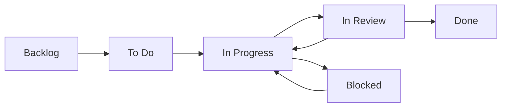

# ⏱️ Time Tracking & Work Verification System

## 🎯 Overview

BarangayLink v2 now includes a comprehensive time tracking system that transforms the Event Control Board into a work-checking app, similar to attendance/time-tracking systems. Users can clock in/out of tasks, track work duration in real-time, and have their completed work verified by supervisors.

## ✨ Key Features

### 1. **Clock In/Clock Out System**
- ✅ Start work timer when beginning a task
- ✅ Option to set custom start time (if started earlier)
- ✅ Real-time timer display on task cards
- ✅ Automatic status transition to "In Progress"
- ✅ Only one active timer per user (prevents multi-tasking)

### 2. **Live Timer Display**
- ✅ Real-time countdown in HH:MM:SS format
- ✅ Pulsing indicator shows active work session
- ✅ Visible on task card while working
- ✅ Updates every second

### 3. **Work Completion & Verification**
- ✅ Clock out with optional work description
- ✅ Option to mark task as complete when clocking out
- ✅ Tasks move to "In Review" status
- ✅ Managers/supervisors can verify and approve
- ✅ Can request revisions if work is incomplete

### 4. **Automatic Workflows**
- ✅ Clock In → Auto-transitions to "In Progress"
- ✅ Clock Out + Mark Complete → Moves to "In Review"
- ✅ Verify + Approve → Moves to "Done"
- ✅ Verify + Request Revision → Back to "In Progress"

### 5. **Time Tracking & Analytics**
- ✅ Tracks actual hours worked on each task
- ✅ Records all work sessions with start/end times
- ✅ Logs work descriptions and comments
- ✅ User work history for attendance tracking

## 📁 Files Added/Modified

### Backend (Convex)
- ✅ `convex/eventTaskTimeTracking.ts` - Time tracking functions
- ✅ `convex/schema.ts` - Already has `eventTaskTimeEntries` table

### Frontend
- ✅ `src/app/events/[eventId]/control/page.tsx` - Enhanced Event Control Board
- ✅ `src/components/layout/Sidebar.tsx` - Added "My Duties" link

## 🔧 Backend Functions

### Mutations

#### `clockIn`
Start tracking time for a task.

```typescript
clockIn({
  taskId: Id<"eventTasks">,
  startTime?: number  // Optional custom start time
})
```

**Features:**
- Prevents multiple active timers per user
- Auto-transitions task to "in_progress"
- Logs activity comment
- Validates user is authenticated

#### `clockOut`
Stop tracking time and record work.

```typescript
clockOut({
  taskId: Id<"eventTasks">,
  description?: string,  // Work description
  markComplete?: boolean // Mark as complete
})
```

**Features:**
- Calculates duration in minutes
- Updates task's actual hours
- Optionally marks task for review
- Logs work description as comment

#### `verifyTask`
Approve or request revision for completed work.

```typescript
verifyTask({
  taskId: Id<"eventTasks">,
  approved: boolean,
  feedback?: string
})
```

**Features:**
- Approves: Moves to "done" status
- Rejects: Moves back to "in_progress"
- Logs feedback as comment

### Queries

#### `getActiveTimeEntry`
Get user's currently running timer.

```typescript
getActiveTimeEntry({
  taskId?: Id<"eventTasks">  // Optional filter
})
```

#### `getTaskTimeEntries`
Get all time entries for a task.

```typescript
getTaskTimeEntries({
  taskId: Id<"eventTasks">
})
```

Returns entries with user details.

#### `getTaskTotalTime`
Get total time logged for a task.

```typescript
getTaskTotalTime({
  taskId: Id<"eventTasks">
})
```

Returns: `{ totalMinutes, totalHours, entryCount }`

#### `getUserWorkHistory`
Get user's work history (for attendance).

```typescript
getUserWorkHistory({
  userId?: Id<"users">,
  startDate?: number,
  endDate?: number
})
```

## 🎨 UI Components

### Enhanced Task Cards

Each task card now displays:
- **Live Timer**: Shows HH:MM:SS when working
- **Clock In Button**: Green button to start work
- **Clock Out Button**: Orange button when timer active
- **Verify Button**: Purple button for "In Review" tasks
- **Status Indicator**: Pulsing dot when timer active

### Dialog Components

#### **Clock In Dialog**
- Choose "Start Now" or custom start time
- Time picker for custom start
- Validates and starts timer

#### **Clock Out Dialog**
- Optional work description textarea
- Checkbox to mark task as complete
- Shows completion will move to "In Review"

#### **Verify Task Dialog**
- Optional feedback textarea
- Two buttons:
  - **Approve** (Green) - Marks done
  - **Request Revision** (Red) - Sends back

## 🔄 Workflow Example

### Worker Perspective

1. **Start Work**
   ```
   Task Card → Click "Clock In" → Choose start time → Timer starts
   Task Status: To Do → In Progress
   ```

2. **Work on Task**
   ```
   Timer runs: 01:23:45 (visible on card)
   Can see elapsed time at any moment
   ```

3. **Complete Work**
   ```
   Task Card → Click "Clock Out" → Add description → Check "Mark as Complete"
   Task Status: In Progress → In Review
   ```

### Manager Perspective

1. **Review Completed Work**
   ```
   See tasks in "In Review" column
   Click "Verify" button
   ```

2. **Approve or Request Revision**
   ```
   Option 1: Approve → Task moves to "Done"
   Option 2: Request Revision → Task back to "In Progress" with feedback
   ```

## 📊 Database Schema

### `eventTaskTimeEntries` Table

```typescript
{
  taskId: Id<"eventTasks">,
  userId: Id<"users">,
  startTime: number,           // Timestamp
  endTime?: number,            // Timestamp (null if running)
  duration?: number,           // Minutes
  description?: string,        // Work description
  isRunning: boolean,          // Active timer flag
  createdAt: number
}
```

**Indexes:**
- `by_task` - Find all entries for a task
- `by_user` - Find user's entries
- `by_running` - Find active timers

## 🎯 Use Cases

### 1. **Daily Work Tracking**
Workers clock in/out throughout the day, creating a complete work log.

### 2. **Attendance System**
Use `getUserWorkHistory` to generate attendance reports.

### 3. **Project Time Estimation**
Compare estimated vs actual hours to improve future estimates.

### 4. **Performance Monitoring**
Track how long tasks take and identify bottlenecks.

### 5. **Quality Control**
Verification workflow ensures work quality before marking complete.

## 🚀 Navigation Updates

### Sidebar - Task Management Section

Added **"My Duties"** link:
- Located under "My Tasks"
- Icon: Briefcase
- Route: `/tasks/my-duties`
- Accessible to all roles

## ⚡ Real-Time Features

### Live Timer
```typescript
// Updates every second
useEffect(() => {
  const interval = setInterval(() => {
    setCurrentTime(Date.now());
  }, 1000);
  return () => clearInterval(interval);
}, []);

// Calculates elapsed time
const getElapsedTime = () => {
  const elapsed = Math.floor((currentTime - startTime) / 1000);
  const hours = Math.floor(elapsed / 3600);
  const minutes = Math.floor((elapsed % 3600) / 60);
  const seconds = elapsed % 60;
  return `${hours}:${minutes}:${seconds}`;
};
```

## 🎨 Visual Design

### Colors & Indicators

- **Clock In Button**: Emerald green (`bg-emerald-600`)
- **Clock Out Button**: Orange (`bg-orange-600`)
- **Verify Button**: Purple (`bg-purple-600`)
- **Active Timer**: Emerald background with pulsing dot
- **Timer Text**: Monospace font, emerald color

### Status Flow Colors

```
To Do (Gray) 
  → Clock In → 
In Progress (Blue) 
  → Clock Out + Complete → 
In Review (Purple) 
  → Verify → 
Done (Green)
```

## 🔒 Security & Validation

### Prevents
- ✅ Multiple active timers per user
- ✅ Clocking in to already clocked-in task
- ✅ Clocking out without active session
- ✅ Unauthenticated access

### Validates
- ✅ User authentication via Clerk
- ✅ Task existence before operations
- ✅ Timer state before clock out
- ✅ Custom start times are valid

## 📈 Analytics Potential

The time tracking data enables:

1. **Individual Performance**
   - Hours worked per day/week/month
   - Task completion rates
   - Average time per task type

2. **Team Analytics**
   - Department productivity
   - Peak work hours
   - Resource allocation insights

3. **Project Insights**
   - Actual vs estimated time
   - Task duration patterns
   - Bottleneck identification

4. **Event Planning**
   - Historical time data for similar events
   - Improved task estimates
   - Better resource planning

## 🎓 Best Practices

### For Workers
1. ✅ Clock in immediately when starting work
2. ✅ Add meaningful descriptions when clocking out
3. ✅ Only mark complete when truly finished
4. ✅ Use custom start time if you forgot to clock in
5. ✅ Complete one task before starting another

### For Managers
1. ✅ Review "In Review" tasks promptly
2. ✅ Provide specific feedback when requesting revisions
3. ✅ Approve quality work quickly to maintain morale
4. ✅ Use time data to improve estimates
5. ✅ Monitor for excessively long task durations

### For Admins
1. ✅ Use work history for attendance tracking
2. ✅ Generate reports from time entry data
3. ✅ Identify training needs from task durations
4. ✅ Optimize workflows based on analytics
5. ✅ Ensure fair work distribution

## 🆘 Troubleshooting

### "Already clocked in to this task"
- **Cause**: Timer already running for this task
- **Solution**: Clock out first, then clock back in

### "Please clock out of your current task first"
- **Cause**: You have an active timer on another task
- **Solution**: Find and clock out of the active task

### "No active time entry found"
- **Cause**: Trying to clock out without clocking in
- **Solution**: Clock in first before clocking out

### Timer not showing
- **Cause**: Not clocked in or page not updated
- **Solution**: Refresh page or clock in to task

### Can't verify task
- **Cause**: Task not in "In Review" status
- **Solution**: Task must be marked complete first

## 🔄 Status Transitions



**Automated Transitions:**
- Clock In → To Do/Backlog → In Progress
- Clock Out + Complete → In Progress → In Review
- Verify + Approve → In Review → Done
- Verify + Reject → In Review → In Progress

## 📱 Mobile Support

All features work on mobile:
- ✅ Touch-friendly buttons
- ✅ Responsive dialogs
- ✅ Live timer visible
- ✅ Easy clock in/out

## 🎉 Benefits

### For the Organization
1. **Accountability**: Clear record of who worked when
2. **Transparency**: Everyone can see task progress
3. **Data-Driven**: Make decisions based on actual time data
4. **Quality Control**: Verification ensures work quality
5. **Efficiency**: Identify and eliminate bottlenecks

### For Workers
1. **Clarity**: Know exactly what needs verification
2. **Recognition**: Work hours are tracked and visible
3. **Fair**: Transparent workload distribution
4. **Feedback**: Get supervisor input on completed work
5. **Protection**: Record of all work performed

### For Managers
1. **Oversight**: Monitor team productivity
2. **Planning**: Better estimates from historical data
3. **Support**: Identify struggling team members
4. **Reporting**: Generate accurate time reports
5. **Optimization**: Improve workflows based on data

## 🚀 Future Enhancements

Potential additions:
- Break time tracking
- Overtime calculation
- Auto-pause for inactivity
- Time entry editing
- Bulk approval
- Export to timesheet
- Mobile push notifications
- Daily/weekly summaries
- Productivity analytics dashboard
- AI-powered time estimates

---

## ✅ Implementation Complete!

The time tracking system is fully integrated and ready to use. Users can now:
- ✅ Clock in/out of tasks
- ✅ See live timers
- ✅ Track work duration
- ✅ Complete and verify tasks
- ✅ Access via "My Duties" in sidebar

**Start using it today to improve productivity and accountability!** ⏱️🎉
